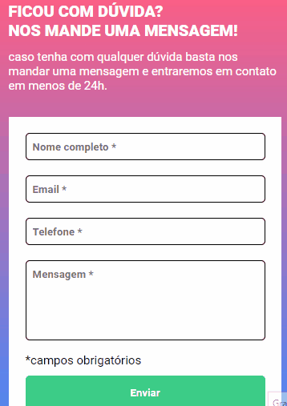

# desafio-js-intermediario


## O desafio
O desafio consiste em construir um formulário com os seguintes itens:
1. A cada input preenchido, deverá alterar a cor da borda para verde.

2. Ao clicar no botão de enviar:
+ O input que **NÃO** estiver preenchido, deverá alterar a cor da borda para vermelho.
+ O input que **NÃO** estiver preenchido, deverá aparecer a mensagem **_campo obrigatório_**.

### Tecnologias utilizadas
- HTML
- CSS
- Javascript

### Dificuldades
A dificuldade, foi associar cada input aos seus respectivos labels. Revisei o conceito do `forEach` consegui aplicar com sucesso. Houve um problema depois de pronto que, supondo que o usuário esqueça de preencher um input, ao clicar em enviar, a mensagem de "campo obrigatório" aparece. Após preencher o campo, o correto, é sumir a mensagem de aviso e a borda do input ficar verde igual aos outros preenchidos.


Para corrigir este problema, fiz uma pequena alteração no código, mas as principais foram:
- na condição verdadeira do if, já tirar as classes que devem aparecer quando o input está vazio.
- na condição falsa, remover as classes de devem aparecer quando o input está preenchido.
```
if(input.value){
    input.classList.remove('padrao', 'campo-nao-preenchido')
    input.classList.add('campo-preenchido')
    input.nextElementSibling.classList.add('esconder')
    input.nextElementSibling.classList.remove('mostrar')
}else{
    input.classList.remove('padrao', 'campo-preenchido')
    input.classList.add('campo-nao-preenchido')
    input.nextElementSibling.classList.remove('esconder')
    input.nextElementSibling.classList.add('mostrar')
};
```

### Demonstração do projeto

