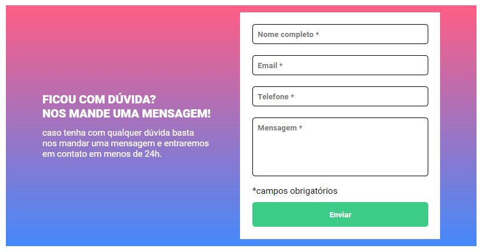

# desafio-js-intermediario

## O desafio
O desafio consiste em construir um formulário com os seguintes itens:
1. A cada input preenchido, deverá alterar a cor da borda para verde.

2. Ao clicar no botão de enviar:
+ O input que **NÃO** estiver preenchido, deverá alterar a cor da borda para vermelho.
+ O input que **NÃO** estiver preenchido, deverá aparecer a mensagem **_campo obrigatório_**.

### Tecnologias utilizadas
- HTML
- CSS
- Javascript

### Dificuldades
escrever depois

### Demonstração do projeto
